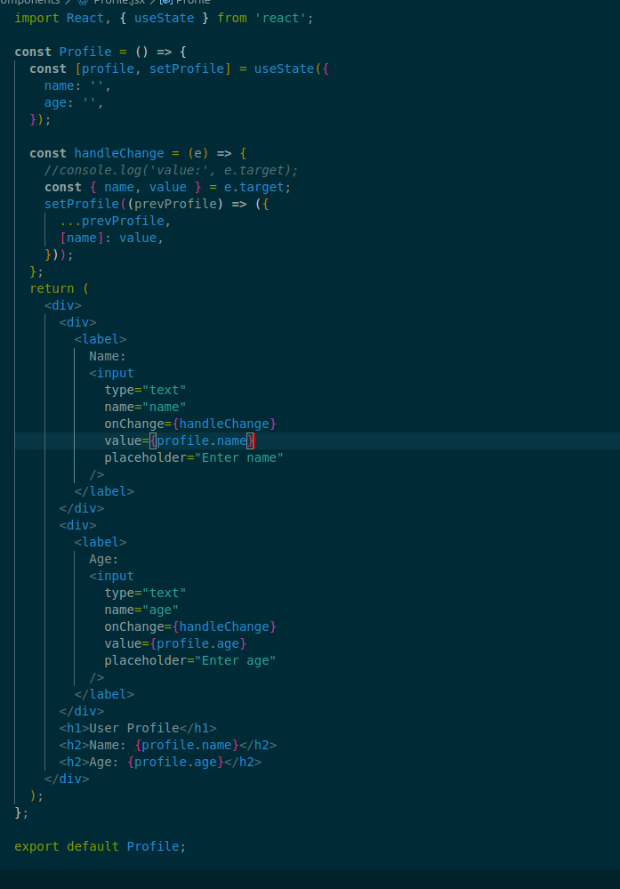

lets consider an example:



Sure! Let's focus on just the `handleChange` function and break it down clearly:

### Here's the function:

```js
const handleChange = (e) => {
  const { name, value } = e.target;
  setProfile((prevProfile) => ({
    ...prevProfile,
    [name]: value,
  }));
};
```

### Step-by-step explanation:

#### 1. **`e` (event)**

- This function runs whenever an input field (`<input>`) changes.
- `e` is the **event object**, and `e.target` is the HTML input element that triggered the event.

#### 2. **Destructuring `name` and `value`**

```js
const { name, value } = e.target;
```

- Suppose you're typing in the "Name" input. `e.target.name` will be `"name"` and `e.target.value` will be the current text entered.
- Similarly, for the "Age" input, `name` would be `"age"`.

#### 3. **Updating state dynamically**

```js
setProfile((prevProfile) => ({
  ...prevProfile,
  [name]: value,
}));
```

- `prevProfile` is the current state: `{ name: "", age: "" }`, or whatever values are currently stored.
- `...prevProfile` spreads (copies) the current state object.
- `[name]: value` dynamically updates either the `"name"` or `"age"` property based on which input changed.

**Example:**

- If you're editing the name field and type "Alice":

  - `name` is `"name"`
  - `value` is `"Alice"`
  - The new state becomes `{ name: "Alice", age: "" }`

- If you then enter "25" in the age field:

  - `name` is `"age"`
  - `value` is `"25"`
  - The new state becomes `{ name: "Alice", age: "25" }`

---

### In simple terms:

**`handleChange`** listens for changes in any input, figures out **which field changed** (`name`), and **updates only that field** in the `profile` state without losing the other data.

Let me know if you want a visual or analogy to reinforce this.
